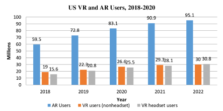
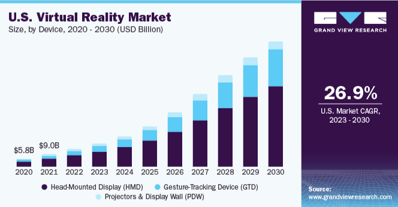
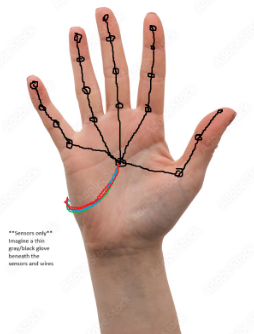
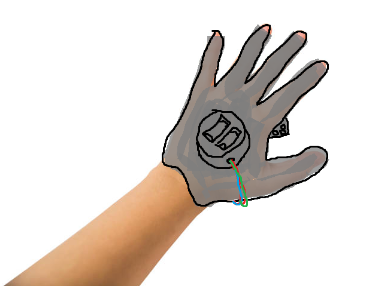

# Iron Fist: The Virtual Fist

## Executive Summary (Overview)
Iron Fist: The Virtual Fist is a new type of VR glove designed to give gamers and tech enthusiasts a more realistic and immersive experience. These gloves use advanced technology to allow users to feel real sensations, such as vibrations and resistance, when interacting with objects in virtual worlds. Unlike other VR gloves that are heavy and very expensive, Iron Fist is light, slim, and much more affordable, making it accessible to more people. The controls can also be customized to fit every user's hand, ensuring comfort during long gaming or work situations.

- Haptic Feedback: The gloves provide physical sensations, such as vibrations and force resistance,  giving players the sensation of interacting with real objects and machinery.
- Precise Motion Tracking:  The gloves capture detailed hand and finger movements, allowing for accurate interaction with the virtual environment,  from turning knobs to handling complex industrial tools.
- Lightweight, Slim Design:  Ergonomically designed for comfort, the gloves are lightweight and slim,  ensuring they are easy to wear for extended periods.
- Customizable Controls:  Users can tailor control settings to their personal preferences,  ensuring a flexible and personalized gameplay experience.
_Iron Fist_ is built for various gamers and developers who want to fully experience virtual reality in a hands-on way. By providing an interactive experience at a lower cost than existing VR gloves, Iron Fist aims to make VR more immersive and accessible for a wider audience, revolutionizing how people interact with virtual environments.

## Market Research and Need Analysis
From my research I've found that there are VR gloves with haptic feedback that exist but so far they are primarily made for businesses that use full body motion and tracking for video games and animated movies. The average price for a pair of VR gloves is $6,000 which is extremely expensive for the common consumer. Some versions of the VR gloves that exist like Haptx VR gloves use backpacks and heavy set ups to use their VR gloves which makes their product a hassle to set up and use for most people. Haptx reports that the gloves weigh 1.25 lbs while the backpack with the charger weighs 22.2 lbs so all together the total weight of this setup is around 24 lbs. [1]

The gloves are super expensive so right now only the rich would be able to afford these gloves. Most of the companies that sell the gloves ask you to contact them with your current project before they’ll even tell you the prices of their gloves. The VR gloves that we’re making will be more affordable, comfortable, and stylish.

#### Graph A

_This chart shows how companies and consumers increased expenses on AR and VR from 2018 to 2022. From this chart we can see that the VR and AR industry will continue to increase in the following years._ [2]

#### Graph B

_This graph shows how spending on research and development of VR, VR gloves, and VR projects/display walls will increase in the coming years. I primarily included this graph to show how much gesture-tracking devices (like VR gloves) will become more popular in the coming years because of the amount of people that want this type of technology. [3] With movies like Ready Player One [4], Spy Kids, and Tron influencing consumers to invest in VR this will bring an uptick in alternate ways of interacting with VR._

## Product Description

The Iron Fist is a lightweight pair of VR gloves designed to provide realistic sensations during interactive experiences. Despite its name, the Iron Fist is designed to be lightweight, easy-to-use, and slim. Features range from advanced haptic feedback to handtracking to customizable controls. It can be connected wirelessly through bluetooth or by USB cable.

The haptic feedback system will have vibration points across the entire hand, providing programmers with the ability to create sensations anywhere on the hand so that they can fully showcase they’re creations how they want.
Hand tracking allows developers and creatives to grasp a new design concept–requiring specific hand motions. While VR controllers allow players to move their hands and grab objects through pushing buttons, this hand tracking system allows players to recreate real hand movements. This is kept track of through sensory points across the hand. These values are given through the Iron Fist software that is accessible to developers. Additionally, plugins are available for popular game engines such as Unity and Unreal. By the time of release, the Iron Fist will be fully compatible and accessible to any developer.

The customizable controls take place on two symmetrical button pads. Because the VR gloves act as a controller, buttons are needed to work with current day games. This is implemented through 2 buttons and a bumper located near the pointer finger joint, accessible to the thumb. Additionally, developers can map button triggers to specific finger movements.

The gloves are powered by a provided rechargeable battery compartment. This is stored on the back of the glove with enough provided space to disperse heat before it reaches the hand. The estimated battery power will be 2-4 hours. This decision was to keep the battery size small and heat low.

#### Diagram A - Sensors and wiring only

#### Diagram B - Mock-up of outer glove and battery compartment

## Possible Problems and Counterarguments
**Competition with existing competitors**

The VR gloves that already exist are not widely or commercially available and are incredibly expensive. We will mass produce our gloves and make them cheaper and more widely available.

**Compatibility**

The Iron Fist software will allow developers to integrate our technology into their games and software. This is still deep in development, but it will allow developers to access sensor details such as local position.

**Battery power and overheating**

We aim for about 2-4 hours of battery power. This is to ensure that overheating will not occur. Additionally, this decision was made because most VR experiences don’t occur for more than 4 hours. 

The battery will be located on the back of the hand, and it will be easily rechargeable. The gloves are also designed for maximum air flow and lightness so that heat and sweat will not be an issue.

**Integration software with existing games**

The VR glove sensors will not be compatible with current games unless updated to implement them. However, you may still use the button pads as controls in those games.

## Conclusion and Recommendations

VR gloves as they exist today are prohibitively expensive and designed specifically for use by enterprises. Current prices range on the lower end of $5,000 and getting a hold of a pair of VR gloves is complicated at best. In addition, they are bulky, heavy, and require heavy equipment (namely a backpack) to operate. They are custom built (thus the high price) and not widely available. There are no VR gloves currently on the market designed for the general population of VR gamers.

Our product looks to rectify this reality. By making our gloves mass produced, lighter, and smaller, we will be able to sell them for much, much cheaper- we look to sell them for at most $500. Mass production in combination with its relatively cheaper price will make them widely available to the public, breaking the market wide open. Furthermore, lightweight gloves will be easier to use for gamers looking for a more immersive experience, and it won’t require a backpack.

This product has the potential to revolutionize VR gaming. For the first time, gamers will have easy access to VR gloves which enhance the immersion of their VR experience. Using haptic feedback, we can make the user feel like they are really grabbing something or feeling something, and with a small trackpad where the thumb would normally rest we don’t need to sacrifice playability.

We recommend going ahead with the product as it has enormous potential for the VR industry as a whole and for profit for our company in particular.

## Bibliography

[1] (N.d.). Haptx.com. Retrieved September 28, 2024, from [https://docs.haptx.com/docs/files/HaptX_Glove_G1_Spec_Sheet_Rev_1.4_Spec.pdf](https://docs.haptx.com/docs/files/HaptX_Glove_G1_Spec_Sheet_Rev_1.4_Spec.pdf)

[2] Posedaru, F.-V. P. T.-M. G. (2020, June). _The Impact of Mobile e-Commerce on GDP: A Comparative Analysis between Romania and Germany and how Covid-19 Influences the e-Commerce Activity Worldwide._ [https://www.researchgate.net/publication/342868068_The_Impact_of_Mobile_e-Commerce_on_GDP_A_Comparative_Analysis_between_Romania_and_Germany_and_how_Covid-19_Influences_the_e-Commerce_Activity_Worldwide](https://www.researchgate.net/publication/342868068_The_Impact_of_Mobile_e-Commerce_on_GDP_A_Comparative_Analysis_between_Romania_and_Germany_and_how_Covid-19_Influences_the_e-Commerce_Activity_Worldwide)

[3] _Virtual Reality (VR) Market Size And Share Report, 2030._ [https://www.grandviewresearch.com/industry-analysis/virtual-reality-vr-market](https://www.grandviewresearch.com/industry-analysis/virtual-reality-vr-market). Accessed 28 Sept. 2024.

[4] _HTC VIVE and “Ready Player One” Debut VR - ProQuest._ [https://www.proquest.com/docview/2011592168?parentSessionId=%2FaGOgDfnsUL4lEgE6o9cgaQR%2FHSV57t4pkGsb%2BTBBTY%3D&pq-origsite=summon&sourcetype=Wire%20Feeds](https://www.proquest.com/docview/2011592168?parentSessionId=%2FaGOgDfnsUL4lEgE6o9cgaQR%2FHSV57t4pkGsb%2BTBBTY%3D&pq-origsite=summon&sourcetype=Wire%20Feeds). Accessed 28 Sept. 2024.

_Note: This template structure  was prepared using suggestions generated by Claude, ChatGPT, and Perplexity. The prompt used for each was “You are a professor teaching freshman students in an interactive games and media program. Your students' first assignment is to work in groups to research and write a proposal for an application. The proposal must make a case for the product, including evidence to support the need for it. It should anticipate counter arguments, as well. Please provide a template for the proposal that can easily be broken into five discrete components for different students to work on.” The ChatGPT response was used as the starting point, but was significantly revised based on ideas from the other LLM tools, as well as the specifics of the intended project outcomes._
